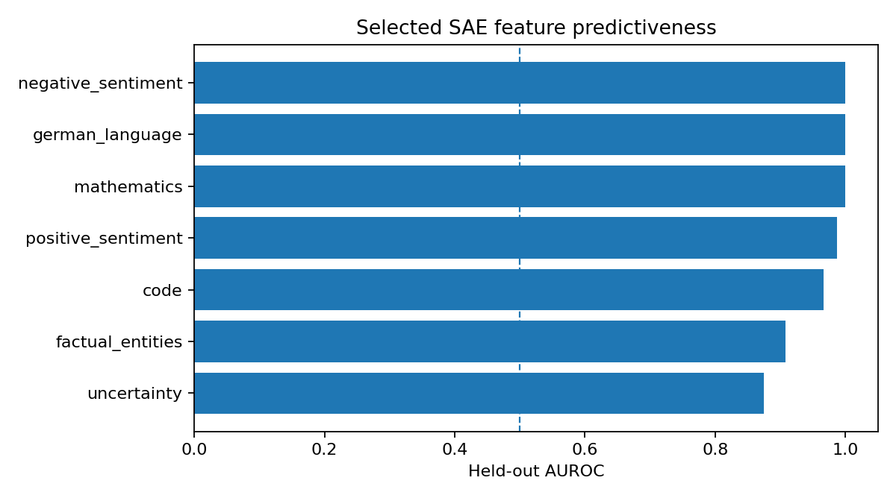
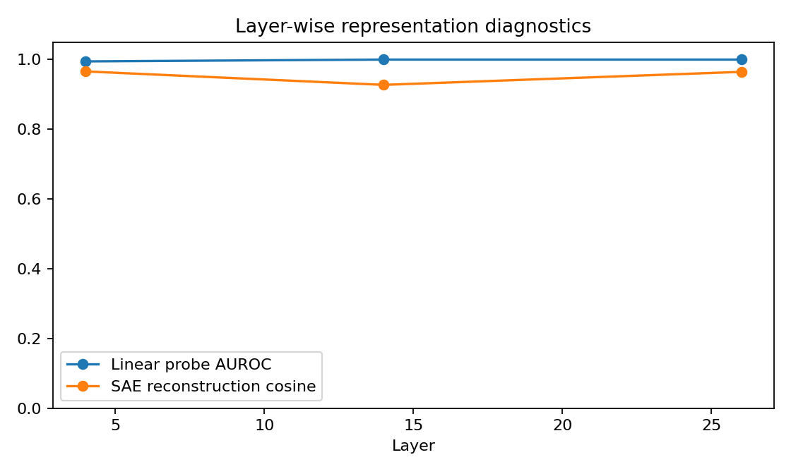
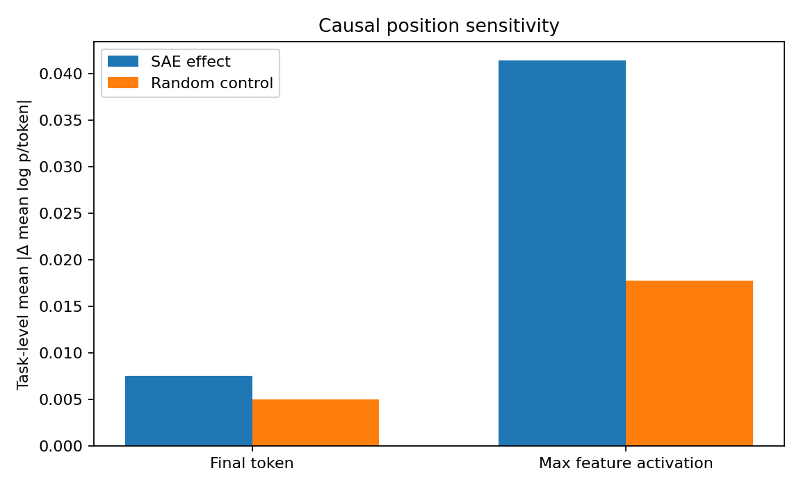
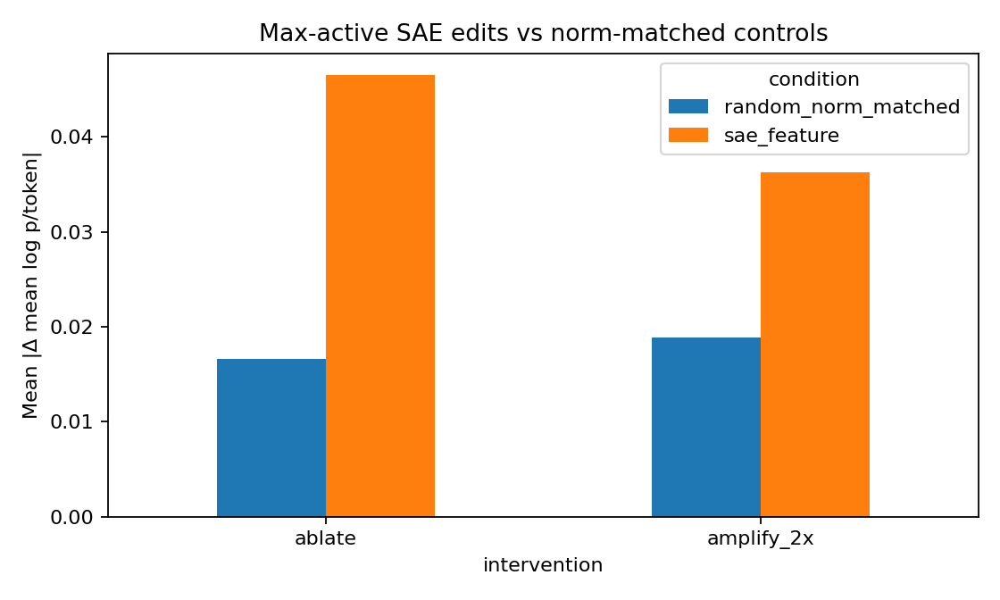
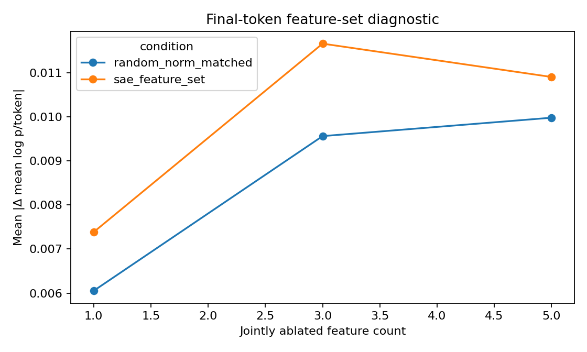
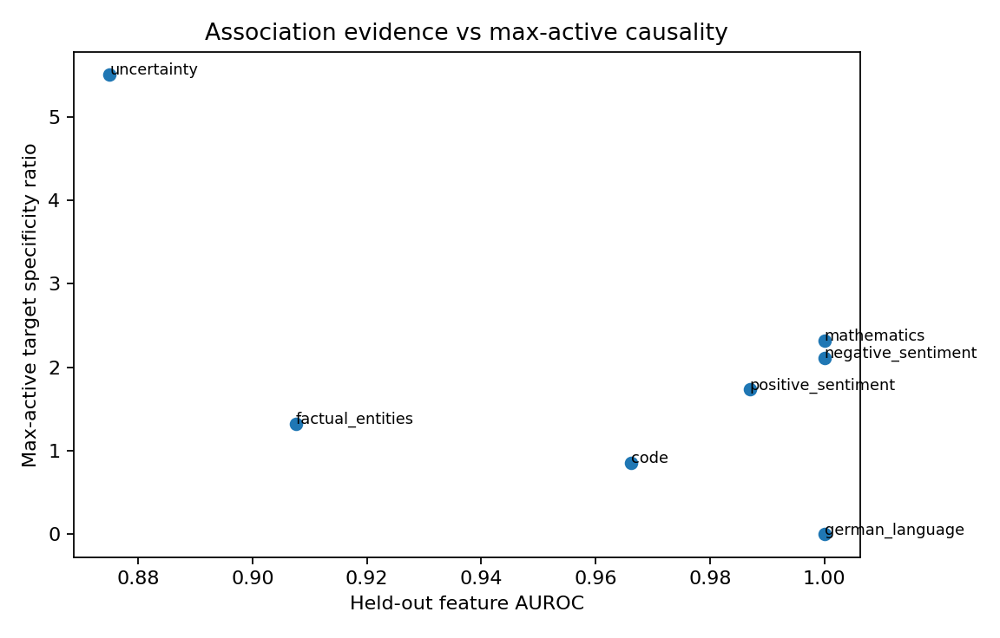

# FeatureLens experiment report

## Research question

**Do sparse features that predict a concept also causally influence model behaviour?**

## Executive summary

Selected SAE features averaged 0.962 held-out AUROC. Max-active interventions covered 82.1% of causal tasks and changed mean log p/token by 0.041 in absolute value on average versus 0.018 for norm-matched random controls (2.33×).

Max-active interventions produced larger task-level target effects than norm-matched random controls with paired uncertainty excluding zero. Predictive SAE features therefore show causal specificity when intervened where the selected feature is actually represented, while the final-token baseline quantifies sensitivity to intervention location. Moving from the final prompt token to the feature's maximum-activation token increased intervention coverage from 28.6% to 82.1%, showing that causal conclusions depend materially on where the representation is tested.

## Key measurements

- Median selected-feature held-out AUROC: 0.987; mean AUROC 95% bootstrap CI [0.927, 0.994].
- Best residual linear-probe layer: 14 with macro AUROC 1.000.
- Mean paraphrase TopK Jaccard: 0.326; sparse activation cosine: 0.985.
- Feature coverage: final-token policy 28.6%; active anywhere in prompt 82.1%; max-active intervention 82.1%.
- Final-token task-level SAE/random ratio: 1.52×; paired advantage +0.0026, 95% CI [-0.0005, +0.0063], sign-flip p=0.1719.
- Max-active task-level SAE/random ratio: 2.33×; paired advantage +0.0237, 95% CI [+0.0067, +0.0469], sign-flip p=0.0001.
- Conditional on feature-active tasks, max-active SAE/random ratio: 2.33× (n=23).
- Final-token top-5 joint ablation SAE/random ratio: 1.09×; paired advantage +0.0009, 95% CI [-0.0035, +0.0065], sign-flip p=0.7891.
- Across seven concepts, held-out AUROC vs max-active target specificity Spearman ρ=-0.185; descriptive only.
- Held-out AUROC vs max-active JS specificity Spearman ρ=-0.148; descriptive only.

## Experimental design

- Model: Qwen3-1.7B-Base.
- SAEs: Qwen-Scope residual-stream TopK SAEs at configured early/middle/late layers.
- Discovery evidence: prompt-wide maximum SAE activation across non-padding tokens; final-token activations are saved separately.
- Split discipline: paraphrase groups remain entirely in train or held-out test.
- Feature selection: training-split AUROC plus activation contrast; held-out AUROC/F1 are reported separately.
- Causal position policies: final prompt token and maximum selected-feature activation within the prompt. Max-active positions are selected from SAE activation only, never from behavioral outcomes.
- Primary causal statistical unit: causal task. Ablation and 2× amplification are averaged within task before paired bootstrap/sign-flip inference.
- Negative control: deterministic norm-matched random residual directions.
- Primary target metric: exact full continuation mean log probability per token under teacher forcing.
- Coverage and conditional-on-active effect strength are reported separately.
- Feature-set analysis remains a final-token diagnostic and is not conflated with the max-active single-feature study.

## Figures

## Position sensitivity

The final-token policy asks whether the selected feature matters at the conventional last-prompt-token intervention site. The max-active policy asks whether it matters where that same feature is most strongly represented in the prompt. Reporting both prevents low final-token coverage from being mistaken for evidence that a predictive feature is globally non-causal.

## Association vs causality across concepts

Cross-concept correlations use max-active random-normalized specificity and are descriptive because the study has seven controlled concepts.

## Interpretation guardrails

High held-out AUROC is correlational evidence. Causal claims require downstream changes relative to norm-matched random controls. Max-active positions are chosen without reference to behavioral effect size. Task-level uncertainty treats ablation and amplification on the same causal prompt as repeated interventions, not independent experimental units.

## Reproducibility

Run `python -m experiments.run_all --resume` for a fresh full study. The causal-addendum notebook is retained as a migration utility for an already-completed final-token baseline.
